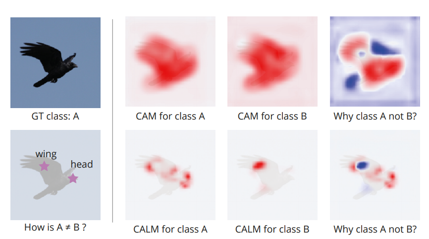
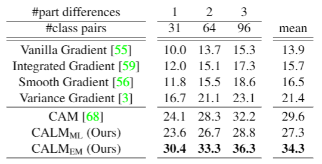
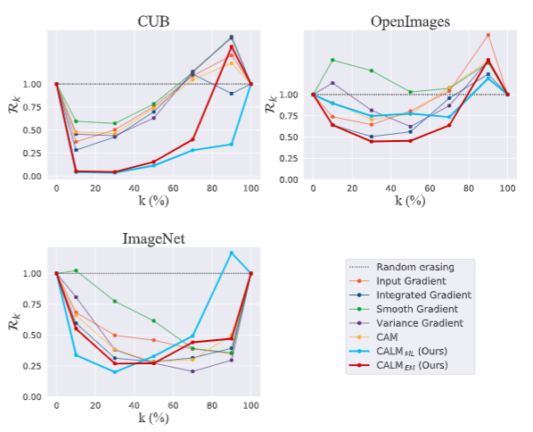

## Keep CALM and Improve Visual Feature Attribution (ICCV 2021) | [Paper](https://arxiv.org/abs/2106.07861)

Jae Myung Kim<sup>1*</sup>, Junsuk Choe<sup>1*</sup>, Zeynep Akata<sup>2</sup>, Seong Joon Oh<sup>1&dagger;</sup>  
<sub>\* Equal contribution</sub> <sub>&dagger;</sub> <sub> Corresponding author </sub>

<sup>1</sup> <sub>NAVER AI LAB</sub>  <sup>2</sup> <sub>University of T&uuml;bingen</sub> 


<p align="center">
</img>
</p>

### Abstract
The class activation mapping, or CAM, has been the cornerstone of feature attribution methods for multiple vision tasks. Its simplicity and effectiveness have led to wide applications in the explanation of visual predictions and weakly-supervised localization tasks. However, CAM has its own shortcomings. The computation of attribution maps relies on ad-hoc calibration steps that are not part of the training computational graph, making it difficult for us to understand the real meaning of the attribution values. In this paper, we improve CAM by explicitly incorporating a latent variable encoding the location of the cue for recognition in the formulation, thereby subsuming the attribution map into the training computational graph. The resulting model, ***class activation latent mapping***, or ***CALM***, is trained with the expectation-maximization algorithm. Our experiments show that CALM identifies discriminative attributes for image classifiers more accurately than CAM and other visual attribution baselines. CALM also shows performance improvements over prior arts on the weakly-supervised object localization benchmarks.

### Dataset downloading
For ImageNet and CUB datasets, please follow the common procedure for downloading the datasets. <br>
For ImageNetV2, CUBV2, and OpenImages30k, please follow the procedure introduced in [wsol-evaluation page](https://github.com/naver-ai/wsolevaluation#2-dataset-downloading-and-license).

### How to use models
You can train CALM models by
```
$ python main.py --experiment_name=experiment_name/ \
                 --architecture=resnet50 \
                 --attribution_method=CALM-EM \
                 --dataset=CUB \
                 --use_bn=True --large_feature_map=True
```

You can evaluate the models on two different metrics,
```
$ python eval_pixel_perturb.py --experiment_name=experiment_name/ \
                               --architecture=resnet50 \ 
                               --attribution_method=CALM-EM \
                               --dataset=CUB \
                               --use_bn=True --large_feature_map=True \
                               --use_load_checkpoint=True \
                               --load_checkpoint=checkpoint_name/ \
                               --score_map_process=jointll --norm_type=clipping &
                               
$ python eval_cue_location.py --experiment_name=experiment_name/ \ 
                              --architecture=resnet50 \
                              --attribution_method=CALM-EM \
                              --dataset=CUB \
                              --use_bn=True --large_feature_map=True \
                              --use_load_checkpoint=True \
                              --load_checkpoint=checkpoint_name/ \
                              --score_map_process=jointll --norm_type=clipping --threshold_type=log &
```

### Pretrained weights
For those who wish to use pretrained CALM weights,
| Model name   |  Dataset  | cls. accuracy  | weights |
|:-------:|:--------:|:--------:|:--------:|
| CALM_EM |  CUB | 71.8 | [link](https://drive.google.com/file/d/1XfBEc1Lh24WqJZP1aLLrwGSlj_INMVef/view?usp=sharing) |
| CALM_EM |  OpenImages | 70.1 | [link](https://drive.google.com/file/d/11250uUiRNafuTbnx2h4kryiVI-7218mW/view?usp=sharing) |
| CALM_EM |  ImageNet | 70.4 | [link](https://drive.google.com/file/d/17451YI9KANnkmmn2ix0N-uHYZljsq4Lc/view?usp=sharing) |
| CALM_ML |   CUB | 59.6 | [link](https://drive.google.com/file/d/1JgupGC2EoIX8wqpYgKPS-3kSLF-29Z8g/view?usp=sharing) |
| CALM_ML | OpenImages | 70.9 | [link](https://drive.google.com/file/d/1QHhiRjO_Oz_yIl64PJqMeCJzK1KUlffA/view?usp=sharing) |
| CALM_ML | ImageNet | 70.6 | [link](https://drive.google.com/file/d/131VHERtxDC-45MhIKgGok-1WxCXUlvdC/view?usp=sharing) |

### Explainability scores
Cue localization and Remove-and-classify results. More details about the metrics are in the paper. 
Cue localization <br> (the higher, the better)      |  Remove-and-classify <br> (the lower, the better)
:-------------------------:|:-------------------------:
  |  

### License

```
Copyright (c) 2021-present NAVER Corp.

Permission is hereby granted, free of charge, to any person obtaining a copy
of this software and associated documentation files (the "Software"), to deal
in the Software without restriction, including without limitation the rights
to use, copy, modify, merge, publish, distribute, sublicense, and/or sell
copies of the Software, and to permit persons to whom the Software is
furnished to do so, subject to the following conditions:

The above copyright notice and this permission notice shall be included in
all copies or substantial portions of the Software.

THE SOFTWARE IS PROVIDED "AS IS", WITHOUT WARRANTY OF ANY KIND, EXPRESS OR
IMPLIED, INCLUDING BUT NOT LIMITED TO THE WARRANTIES OF MERCHANTABILITY,
FITNESS FOR A PARTICULAR PURPOSE AND NONINFRINGEMENT.  IN NO EVENT SHALL THE
AUTHORS OR COPYRIGHT HOLDERS BE LIABLE FOR ANY CLAIM, DAMAGES OR OTHER
LIABILITY, WHETHER IN AN ACTION OF CONTRACT, TORT OR OTHERWISE, ARISING FROM,
OUT OF OR IN CONNECTION WITH THE SOFTWARE OR THE USE OR OTHER DEALINGS IN
THE SOFTWARE.
```

### How to cite
```
@article{kim2021iccv,
  title={Keep CALM and Improve Visual Feature Attribution},
  author={Kim, Jae Myung and Choe, Junsuk and Akata, Zeynep and Oh, Seong Joon},
  year={2021},
  booktitle = {International Conference on Computer Vision (ICCV)},
  note = {to appear},
  pubstate = {published},
  tppubtype = {inproceedings},
}
```
